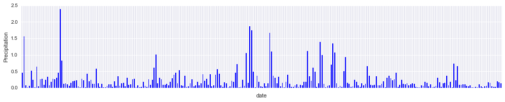
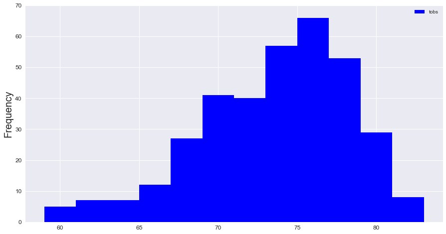
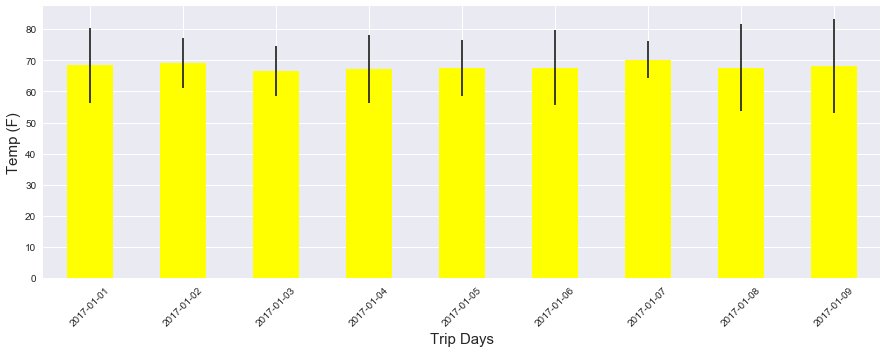
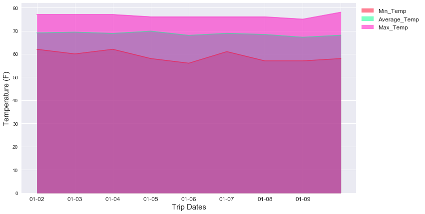

Congratulations! You've decided to treat yourself to a long holiday vacation in Honolulu, Hawaii! To help with your trip planning, you need to do some climate analysis on the area. The following outlines what you need to do.

## Step 1 - Climate Analysis and Exploration

To begin, use Python and SQLAlchemy to do basic climate analysis and data exploration of your climate database. All of the following analysis should be completed using SQLAlchemy ORM queries, Pandas, and Matplotlib.

* Use the provided [starter notebook](climate_starter.ipynb) and [hawaii.sqlite](Resources/hawaii.sqlite) files to complete your climate analysis and data exploration.

* Choose a start date and end date for your trip. Make sure that your vacation range is approximately 3-15 days total.

* Use SQLAlchemy `create_engine` to connect to your sqlite database.

* Use SQLAlchemy `automap_base()` to reflect your tables into classes and save a reference to those classes called `Station` and `Measurement`.

```python
import matplotlib
from matplotlib import style
style.use('seaborn')
import matplotlib.pyplot as plt
import datetime as dt
import pandas as pd
import numpy as np
from scipy import stats
```


```python
# Importing SQLAlchemy `automap` and other dependencies here
import sqlalchemy
from sqlalchemy.ext.automap import automap_base
from sqlalchemy.orm import Session
from sqlalchemy import create_engine, inspect, func

```


```python
# create engine for connecting to hawaii.sqlite db
engine = create_engine("sqlite:///Resources_cleaned/hawaii.sqlite")
```


```python
# inspecting tables to ensure that they are suitable for further analysis
inspector = inspect(engine)
inspector.get_table_names()
```


    ['measurement', 'station']


```python
# Checking data types for measurement table
cols = inspector.get_columns('measurement')
for column in cols:
    print(column['name'], column['type'], column['primary_key'])
```

    measurement_id INTEGER 1
    station_id VARCHAR 0
    date DATETIME 0
    prcp FLOAT 0
    tobs INTEGER 0
    


```python
# Checking data types for station table
cols = inspector.get_columns('station')
for column in cols:
    print(column['name'], column['type'], column['primary_key'])
```

    station_id VARCHAR 1
    name VARCHAR 0
    latitude FLOAT 0
    longitude FLOAT 0
    elevation FLOAT 0
    

### Reflect Database into ORM class and Query


```python
# Reflect Database into ORM class
Base = automap_base()
Base.prepare(engine, reflect=True)
Station = Base.classes.station
Measurement = Base.classes.measurement
```


```python
# Start a session to query the database
session = Session(engine)
```


```python
Base.classes.keys()
```


    ['measurement', 'station']


```python
result = session.query(Station.station_id, Station.name, Station.latitude, Station.longitude, Station.elevation).all()
print(result[0])
```

    ('USC00519397', 'WAIKIKI 717.2, HI US', 21.2716, -157.8168, 3.0)
    

# Precipitation Analysis


```python
#find the latest date in db ## Also unpacking tuple
latest_date, = session.query(Measurement.date).order_by(Measurement.date.desc()).first()
print(latest_date)

```

    2017-08-23 00:00:00
    


```python
query_date = latest_date - dt.timedelta(days=365)
print(query_date)
```

    2016-08-23 00:00:00
    


```python
# Query all dates and prcp values within last one year
results = session.query(Measurement.date, Measurement.prcp).filter(Measurement.date>=query_date).all()

```


```python
# Loading query results in dataframe
df = pd.DataFrame(results, columns=['date','precipitation'])
df = df.sort_values('date',ascending=True)
# df = df.set_index('date')
df.head()
```


<div>
<style scoped>
    .dataframe tbody tr th:only-of-type {
        vertical-align: middle;
    }

    .dataframe tbody tr th {
        vertical-align: top;
    }

    .dataframe thead th {
        text-align: right;
    }
</style>
<table border="1" class="dataframe">
  <thead>
    <tr style="text-align: right;">
      <th></th>
      <th>date</th>
      <th>precipitation</th>
    </tr>
  </thead>
  <tbody>
    <tr>
      <th>0</th>
      <td>2016-08-23</td>
      <td>0.00</td>
    </tr>
    <tr>
      <th>1027</th>
      <td>2016-08-23</td>
      <td>0.02</td>
    </tr>
    <tr>
      <th>702</th>
      <td>2016-08-23</td>
      <td>0.05</td>
    </tr>
    <tr>
      <th>1693</th>
      <td>2016-08-23</td>
      <td>0.70</td>
    </tr>
    <tr>
      <th>359</th>
      <td>2016-08-23</td>
      <td>0.15</td>
    </tr>
  </tbody>
</table>
</div>


```python
# checkin data types

df.dtypes
```


    date             datetime64[ns]
    precipitation           float64
    dtype: object


```python
df.count()
```


    date             2021
    precipitation    2021
    dtype: int64


* Summary Statistics for Precipitation Data


```python
print(df.describe().round(2))
```

           precipitation
    count        2021.00
    mean            0.18
    std             0.46
    min             0.00
    25%             0.00
    50%             0.02
    75%             0.13
    max             6.70
    

To get more sense out of the Plot of precipitation data, I averaged measurement value for each day, so we will end up with one mean precipitation value for each day. 


```python
df_bydate = df.groupby('date').agg(np.mean)
df_bydate.head()
```


<div>
<style scoped>
    .dataframe tbody tr th:only-of-type {
        vertical-align: middle;
    }

    .dataframe tbody tr th {
        vertical-align: top;
    }

    .dataframe thead th {
        text-align: right;
    }
</style>
<table border="1" class="dataframe">
  <thead>
    <tr style="text-align: right;">
      <th></th>
      <th>precipitation</th>
    </tr>
    <tr>
      <th>date</th>
      <th></th>
    </tr>
  </thead>
  <tbody>
    <tr>
      <th>2016-08-23</th>
      <td>0.451667</td>
    </tr>
    <tr>
      <th>2016-08-24</th>
      <td>1.555000</td>
    </tr>
    <tr>
      <th>2016-08-25</th>
      <td>0.077143</td>
    </tr>
    <tr>
      <th>2016-08-26</th>
      <td>0.016667</td>
    </tr>
    <tr>
      <th>2016-08-27</th>
      <td>0.064000</td>
    </tr>
  </tbody>
</table>
</div>


```python
df_test = df_bydate[df_bydate['precipitation']>.01]
fig, ax = plt.subplots(figsize=(17,3))
df_test['precipitation'].plot(kind='bar', ax=ax, color='blue')
ax.set_xticklabels('')
ax.set_ylabel('Precipitation')
# ax.set_xticks()
```


    Text(0,0.5,'Precipitation')





## Station Analysis


```python
# Checking data types for station table
cols = inspector.get_columns('station')
for column in cols:
    print(column['name'], column['type'], column['primary_key'])
```

    station_id VARCHAR 1
    name VARCHAR 0
    latitude FLOAT 0
    longitude FLOAT 0
    elevation FLOAT 0
    


```python
# Checking data types for measurement table
cols = inspector.get_columns('measurement')
for column in cols:
    print(column['name'], column['type'], column['primary_key'])
```

    measurement_id INTEGER 1
    station_id VARCHAR 0
    date DATETIME 0
    prcp FLOAT 0
    tobs INTEGER 0
    

###### Querying the total number of stations.


```python
# Counting the number of stations
session.query(Station.name).count()

```


    9


###### The Most Active Stations

* listing the stations and observation counts in descending order


```python
session.query(Measurement.station_id ,func.count(Measurement.station_id)).group_by(Measurement.station_id).\
            order_by(func.count(Measurement.station_id).desc()).all()

```


    [('USC00519281', 2772),
     ('USC00513117', 2696),
     ('USC00519397', 2685),
     ('USC00519523', 2572),
     ('USC00516128', 2484),
     ('USC00514830', 1937),
     ('USC00511918', 1932),
     ('USC00517948', 683),
     ('USC00518838', 342)]


* Station with the highest number of observation


```python
session.query(Station.station_id, Station.name, Station.latitude, Station.longitude, Station.elevation ,func.count(Measurement.station_id)).\
            filter(Measurement.station_id == Station.station_id).group_by(Measurement.station_id).\
            order_by(func.count(Measurement.station_id).desc()).first()

```


    ('USC00519281',
     'WAIHEE 837.5, HI US',
     21.45167,
     -157.84888999999995,
     32.9,
     2772)


* Design a query to retrieve the last 12 months of temperature observation data (tobs).

  * Filter by the station with the highest number of observations.

  * Plot the results as a histogram with `bins=12`.


```python
# query to find tobs for most active station
tob_results = session.query(Measurement.tobs).filter(Measurement.date>=query_date).\
                        filter(Measurement.station_id == 'USC00519281').all()
# print(tob_results,)
```


```python
# importing query results to df
df_tob = pd.DataFrame(tob_results, columns=['Temperature'])
df_tob.describe()
```


<div>
<style scoped>
    .dataframe tbody tr th:only-of-type {
        vertical-align: middle;
    }

    .dataframe tbody tr th {
        vertical-align: top;
    }

    .dataframe thead th {
        text-align: right;
    }
</style>
<table border="1" class="dataframe">
  <thead>
    <tr style="text-align: right;">
      <th></th>
      <th>Temperature</th>
    </tr>
  </thead>
  <tbody>
    <tr>
      <th>count</th>
      <td>352.000000</td>
    </tr>
    <tr>
      <th>mean</th>
      <td>73.107955</td>
    </tr>
    <tr>
      <th>std</th>
      <td>4.733315</td>
    </tr>
    <tr>
      <th>min</th>
      <td>59.000000</td>
    </tr>
    <tr>
      <th>25%</th>
      <td>70.000000</td>
    </tr>
    <tr>
      <th>50%</th>
      <td>74.000000</td>
    </tr>
    <tr>
      <th>75%</th>
      <td>77.000000</td>
    </tr>
    <tr>
      <th>max</th>
      <td>83.000000</td>
    </tr>
  </tbody>
</table>
</div>


```python
# plotting histogram
bins=[]
fig, ax = plt.subplots(figsize=(15,8))
df_tob.hist(bins=12, ax=ax, color='blue', xlabelsize=12, ylabelsize=12, label='tobs')
ax.set_title('')
ax.legend()
plt.rc('legend', fontsize=25)
ax.set_ylabel('Frequency',fontsize=20)
ax.set_ylim(top=70)

```


    (0.0, 70)





### Temperature Analysis

* Defining a function that will accept a start date and end date in the format `%Y-%m-%d` and return the minimum, average, and maximum temperatures for that range of dates.


```python
def calc_temps(start_date, end_date):
    """ Returns the min, avg and max temp for a range of dates
    ARGS: start_date, end_date - A string ("%Y-%m-%d")
    Returns: list of tuples containing min, avg and max temps
    """
    sd = dt.datetime.strptime(start_date, "%Y-%m-%d")
    ed = dt.datetime.strptime(end_date, "%Y-%m-%d")
    result = session.query(Measurement.date, func.max(Measurement.tobs),func.avg(Measurement.tobs),func.min(Measurement.tobs)).\
                filter(Measurement.date>=start_date).filter(Measurement.date<=end_date).group_by(Measurement.date).all()
    return result
```

* Using the `calc_temps` function to calculate the min, avg, and max temperatures for the trip duration, using dates from an year earlier


```python
trip_start = "2017-01-01"; trip_end = "2017-01-10"
temperatures_trip = calc_temps(trip_start, trip_end)
df_triptemp = pd.DataFrame(temperatures_trip, columns=['Date', 'Max. Temp', 'Mean Temp', 'Min. Temp'])
df_triptemp['Date'] = df_triptemp['Date'].dt.date
df_triptemp = df_triptemp.set_index('Date')
df_triptemp
```


<div>
<style scoped>
    .dataframe tbody tr th:only-of-type {
        vertical-align: middle;
    }

    .dataframe tbody tr th {
        vertical-align: top;
    }

    .dataframe thead th {
        text-align: right;
    }
</style>
<table border="1" class="dataframe">
  <thead>
    <tr style="text-align: right;">
      <th></th>
      <th>Max. Temp</th>
      <th>Mean Temp</th>
      <th>Min. Temp</th>
    </tr>
    <tr>
      <th>Date</th>
      <th></th>
      <th></th>
      <th></th>
    </tr>
  </thead>
  <tbody>
    <tr>
      <th>2017-01-01</th>
      <td>74</td>
      <td>68.400000</td>
      <td>62</td>
    </tr>
    <tr>
      <th>2017-01-02</th>
      <td>74</td>
      <td>69.200000</td>
      <td>66</td>
    </tr>
    <tr>
      <th>2017-01-03</th>
      <td>71</td>
      <td>66.600000</td>
      <td>63</td>
    </tr>
    <tr>
      <th>2017-01-04</th>
      <td>73</td>
      <td>67.166667</td>
      <td>62</td>
    </tr>
    <tr>
      <th>2017-01-05</th>
      <td>72</td>
      <td>67.500000</td>
      <td>63</td>
    </tr>
    <tr>
      <th>2017-01-06</th>
      <td>74</td>
      <td>67.666667</td>
      <td>62</td>
    </tr>
    <tr>
      <th>2017-01-07</th>
      <td>72</td>
      <td>70.166667</td>
      <td>66</td>
    </tr>
    <tr>
      <th>2017-01-08</th>
      <td>74</td>
      <td>67.666667</td>
      <td>60</td>
    </tr>
    <tr>
      <th>2017-01-09</th>
      <td>77</td>
      <td>68.166667</td>
      <td>62</td>
    </tr>
  </tbody>
</table>
</div>


* Plotting the bar chart with average value and tmax-tmin as y error bar.


```python
# yerr = [df_triptemp['Max. Temp'].sem(), df_triptemp['Mean Temp'].sem(), df_triptemp['Min. Temp'].sem()]
yerr = df_triptemp['Max. Temp'] - df_triptemp['Min. Temp']
fig, ax = plt.subplots(figsize=(15,5))
df_triptemp['Mean Temp'].plot(kind='bar',color='yellow',yerr=yerr, ax=ax)
ax.set_ylabel('Temp (F)', fontsize=15)
ax.set_xlabel('Trip Days', fontsize=15)

for tick in ax.get_yticklabels():
    tick_setfontsize=12
for value in ax.get_xticklabels():
#     value.
    value.set_fontsize=20
    value.set_rotation(45)
```





* Calculation of rainfall per weather station using the previous year's matching dates.
    * defining function `calc_rainfall` for calculating total rainfall for every weather station.


```python
def calc_rainfall(start_date, end_date):
    """ Calculating total rainfall for every weather station
    Args:
        start_date(str), end_date(str): date strings in format "%Y-%m-%d"
    Returns:
        A list of tuples containing the stationID and total rainfall
    """
    sd = dt.datetime.strptime(start_date, "%Y-%m-%d")
    ed = dt.datetime.strptime(end_date, "%Y-%m-%d")
    result = session.query(Measurement.station_id, func.sum(Measurement.prcp)).\
                filter(Measurement.date>=start_date).filter(Measurement.date<=end_date).group_by(Measurement.station_id).all()
    return result
```


```python
trip_start = "2017-01-01"; trip_end = "2017-01-10" # dates one year ago
rainfall_trip = calc_rainfall(trip_start, trip_end)
df_triprainfall = pd.DataFrame(rainfall_trip, columns=['Station_id', 'Total_Rainfall'])
df_triprainfall
```


<div>
<style scoped>
    .dataframe tbody tr th:only-of-type {
        vertical-align: middle;
    }

    .dataframe tbody tr th {
        vertical-align: top;
    }

    .dataframe thead th {
        text-align: right;
    }
</style>
<table border="1" class="dataframe">
  <thead>
    <tr style="text-align: right;">
      <th></th>
      <th>Station_id</th>
      <th>Total_Rainfall</th>
    </tr>
  </thead>
  <tbody>
    <tr>
      <th>0</th>
      <td>USC00513117</td>
      <td>0.35</td>
    </tr>
    <tr>
      <th>1</th>
      <td>USC00514830</td>
      <td>0.63</td>
    </tr>
    <tr>
      <th>2</th>
      <td>USC00516128</td>
      <td>0.63</td>
    </tr>
    <tr>
      <th>3</th>
      <td>USC00519281</td>
      <td>0.20</td>
    </tr>
    <tr>
      <th>4</th>
      <td>USC00519397</td>
      <td>0.00</td>
    </tr>
    <tr>
      <th>5</th>
      <td>USC00519523</td>
      <td>0.61</td>
    </tr>
  </tbody>
</table>
</div>


* Calculation of the daily normals (Temperatures). Normals are the averages for min, avg, and max temperatures.

  * Creating a function called `daily_normals` that will calculate the daily normals for a specific date. Input date string will be in the format `%m-%d`.


```python
# Creating a function for calculating daily normals
def daily_normals(date):
    """Calculating Daily Normals (temperature)
    Args:
        date(str): A date string in format "%m-%d"
    Returns:
        A list of tuples containing the daily normals, tmin, tavg, and tmax
    """
    sel = [func.min(Measurement.tobs), func.avg(Measurement.tobs), func.max(Measurement.tobs)]    
    daily_normal = session.query(*sel).filter(func.strftime("%m-%d", Measurement.date) == date).all()
    return daily_normal
    
```

  * Calculating Normals (temps) during the trip (same dates previous year) using function `daily_normals`.

  


```python
trip_st = dt.datetime.strptime(trip_start, "%Y-%m-%d")
trip_duration = 9 #days
trip_min=[]; trip_avg=[]; trip_max=[]; trip_date=[]
for day in range(trip_duration):
    date = trip_st + dt.timedelta(days=day)
    date_str = dt.datetime.strftime(date, "%m-%d")
    normals, = daily_normals(date_str)
    trip_min.append(normals[0])
    trip_avg.append(normals[1])
    trip_max.append(normals[2])
    trip_date.append(date_str)
trip_normals = {'Trip_Date':trip_date, 'Min_Temp': trip_min, 'Average_Temp': trip_avg, 'Max_Temp': trip_max}
df_trip_nortemps = pd.DataFrame(trip_normals, columns=['Trip_Date', 'Min_Temp','Average_Temp','Max_Temp'])
df_trip_nortemps = df_trip_nortemps.set_index('Trip_Date')
df_trip_nortemps
```


<div>
<style scoped>
    .dataframe tbody tr th:only-of-type {
        vertical-align: middle;
    }

    .dataframe tbody tr th {
        vertical-align: top;
    }

    .dataframe thead th {
        text-align: right;
    }
</style>
<table border="1" class="dataframe">
  <thead>
    <tr style="text-align: right;">
      <th></th>
      <th>Min_Temp</th>
      <th>Average_Temp</th>
      <th>Max_Temp</th>
    </tr>
    <tr>
      <th>Trip_Date</th>
      <th></th>
      <th></th>
      <th></th>
    </tr>
  </thead>
  <tbody>
    <tr>
      <th>01-01</th>
      <td>62</td>
      <td>69.060000</td>
      <td>77</td>
    </tr>
    <tr>
      <th>01-02</th>
      <td>60</td>
      <td>69.408163</td>
      <td>77</td>
    </tr>
    <tr>
      <th>01-03</th>
      <td>62</td>
      <td>68.833333</td>
      <td>77</td>
    </tr>
    <tr>
      <th>01-04</th>
      <td>58</td>
      <td>69.836364</td>
      <td>76</td>
    </tr>
    <tr>
      <th>01-05</th>
      <td>56</td>
      <td>68.000000</td>
      <td>76</td>
    </tr>
    <tr>
      <th>01-06</th>
      <td>61</td>
      <td>68.886792</td>
      <td>76</td>
    </tr>
    <tr>
      <th>01-07</th>
      <td>57</td>
      <td>68.381818</td>
      <td>76</td>
    </tr>
    <tr>
      <th>01-08</th>
      <td>57</td>
      <td>67.200000</td>
      <td>75</td>
    </tr>
    <tr>
      <th>01-09</th>
      <td>58</td>
      <td>68.072727</td>
      <td>78</td>
    </tr>
  </tbody>
</table>
</div>


  * Using Pandas to plot an area plot (`stacked=False`) for the daily normals.
  


```python
fig, ax = plt.subplots(figsize=(12,7))
df_trip_nortemps.plot(kind='area', ax=ax, stacked=False, alpha=0.5, cmap='gist_rainbow')
ax.legend(bbox_to_anchor = (1,1),loc='best', fontsize='large')
ax.set_xticklabels(labels=df_trip_nortemps.index, fontsize=12)
ax.set_ylabel('Temperature (F)', fontsize=15)
ax.set_xlabel('Trip Dates', fontsize=15)
# ax.fill_between(df_trip_nortemps.index, df_trip_nortemps['Min_Temp'], facecolor='red', alpha=0.5)
# ax.fill_between(x=df_trip_nortemps['Min_Temp'], df_trip_nortemps['Average_Temp'], facecolor='blue', alpha=0.5)
# ax.fill_between(df_trip_nortemps.index, df_trip_nortemps['Max_Temp'], facecolor='black', alpha=0.5)
```


    Text(0.5,0,'Trip Dates')



