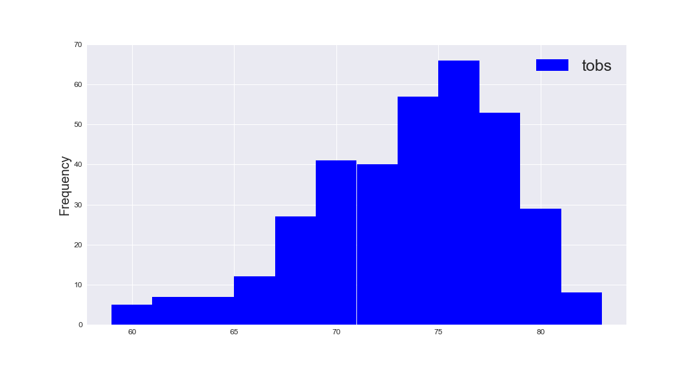
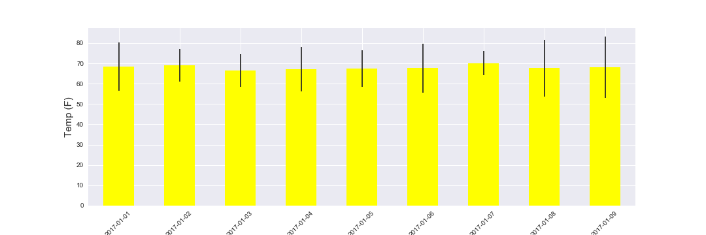
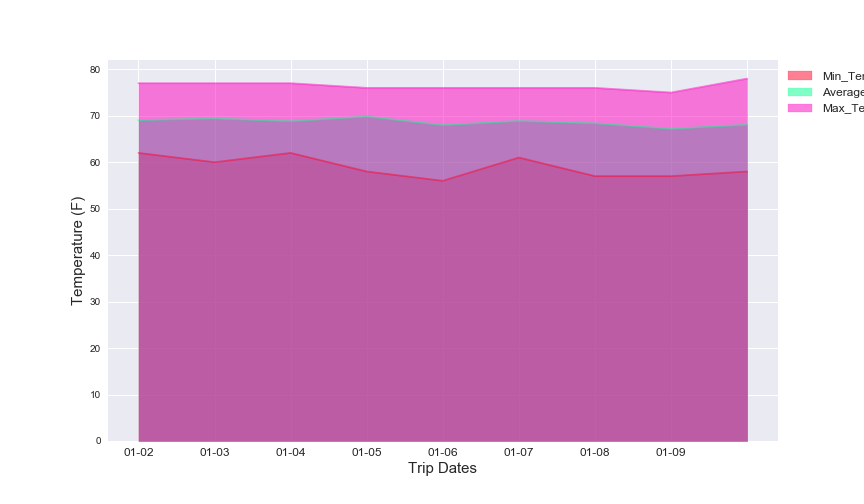

# Hawaii Climate Analysis
Hawaii climate is being analyzed in this project. I addition, climate API is generated using flask server, which will serve as input for front-end programming. This analysis was carried out in these steps:
## Backend Engineering
#### Step 1 - Data Engineering "data_engineering.ipynb"
* Data from csv files was cleaned and prepared for the analysis. Cleaned csv files were resaved in "Cleaned_CSV" folder.

#### Step 2 - Database Engineering "database_engineering.ipynb"
* Using SQLAlchemy (declarative_base) to model table schemas and create a sqlite database for the two tables.
* Sqlite database was saved in folder "Resources_cleaned"

#### Step 3 -  Create FLASK API "app.py", by reflecting db into ORM classes and then creating queries. The routes created were:
* /api/v1.0/precipitation
* /api/v1.0/stations
* /api/v1.0/tobs
* /api/v1.0/ (start date as '%Y-%m-%d')
* /api/v1.0//(start/end date as '%Y-%m-%d') 

## Climate Analysis
* Precipitation Analysis

* Station Analysis

* Temperature Analysis

